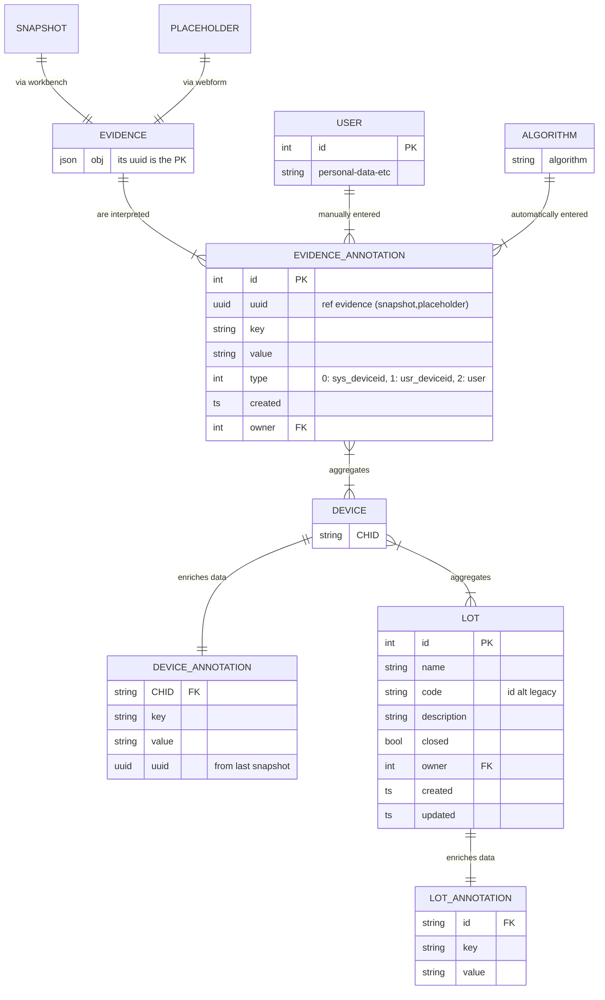

Modelo de datos *abstracto* de devicehub que ayuda a tener una idea de cómo funciona

Recordad que por ser este un proyecto de django, se puede obtener de forma automatizada un diagrama de datos con el comando `graph_models` (más adelante vemos de documentar mejor cómo generarlo)

